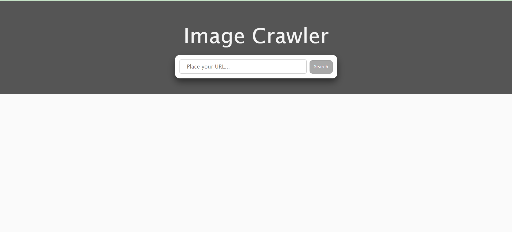
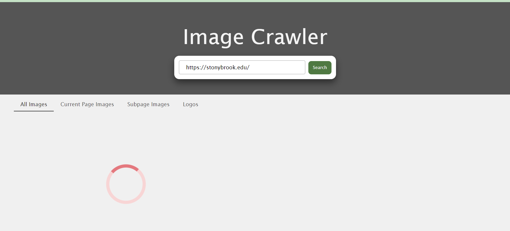

## Image Crawler
The goal of this project is to perform a web crawling on a URL string provided by the user. From the crawl, it parses out and displays all the images on that web page and its sub-pages of same domain on the page.

### Functionalities Developed
The project is able to achieve the following goals:
- Crawling down the images of the input URl
- Crawling sub-pages of same domain to find more images.
- Implemented multi-threading to crawl multiple sub-pages of same domain at a time.
- Handled re-crawling any pages that have already been visited.

## Structure
The ImageFinder servlet is found in `src/main/java/com/eulerity/hackathon/imagefinder/ImageFinder.java`.
The main landing page for this project can be found in `src/main/webapp/index.html`.
Finally, in the root directory of this project, you will find the `pom.xml`. This contains the project configuration details used by maven to build the project.

## Running the Project
Below details helps you to know how to set up and run this project, so you may get started, as well as the requirements needed to do so.

### Requirements
Before beginning, make sure you have the following installed and ready to use
- Maven 3.5 or higher
- Java 8
  - Exact version, **NOT** Java 9+ - the build will fail with a newer version of Java

### Setup
To start, open a terminal window and navigate to wherever you unzipped to the root directory `imagefinder`. To build the project, run the command:

>`mvn package`

If all goes well you should see some lines that end with "BUILD SUCCESS". When you build your project, maven should build it in the `target` directory. To clear this, you may run the command:

>`mvn clean`

To run the project, use the following command to start the server:

>`mvn clean test package jetty:run`

You should see a line at the bottom that says "Started Jetty Server". Now, if you enter `localhost:8080` into your browser, you should see the `index.html` welcome page! If all has gone well to this point, you're ready to begin!

## Final Outcome
- ### Default home screen

- ### Loading screen

- ### Output screen

- ### Logos screen
